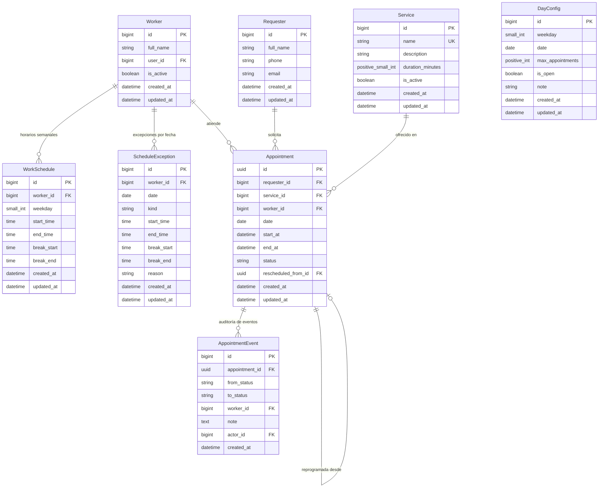

# Agenda de Citas (microapp Django)

Microapp para gestionar citas: apertura y cierre de agenda, cupos por día, asignación automática de personal, lista de espera, cancelación y reposición de fechas.

## Stack

- Python 3.12+, Django 5.x / 6.x, Django REST Framework
- Gestión de entorno y dependencias: [uv](https://docs.astral.sh/uv/) (`pyproject.toml` + `uv.lock`)
- PostgreSQL (SQLite para pruebas unitarias locales)
- Celery + Redis (opcional: reasignación de espera, recordatorios)
- pytest + pytest-django, ruff
- Zona horaria: `America/Mexico_City`

## Conceptos clave

| Concepto | Descripción |
|---|---|
| **Solicitante** | Persona que pide la cita (nombre, teléfono normalizado, correo). |
| **Servicio** | Tipo de cita con duración en minutos (**≤ 60**, configurable). |
| **Trabajador** | Personal que atiende. Tiene horario propio por día de la semana. |
| **Horario laboral** | Entrada, salida y descanso opcional por trabajador y día. |
| **Excepción de horario** | Ausencia, vacaciones o horario especial en una fecha concreta. |
| **Configuración de día** | Cupo máximo de citas y estado abierto/cerrado, por día de la semana (default) o por fecha (override). |
| **Cita** | Solicitante + servicio + fecha/hora + trabajador (nulo si está en espera). Identificador UUID v4. |
| **Evento de Cita** | Registro inmutable de auditoría para cada transición de estado de una cita. |
| **Lista de espera** | Citas sin trabajador disponible; se asignan por orden de llegada (FIFO). |

## Modelo de datos



### Reglas de validación e integridad en modelos

| Modelo | Regla / Constraint | Nivel | Descripción |
|---|---|---|---|
| **`Requester`** | `requester_phone_or_email_required` | `clean()` + `CheckConstraint` | Al menos uno de `phone` o `email` debe estar presente y no vacío. |
| **`Service`** | `service_duration_range` | `clean()` + `CheckConstraint` | `5 <= duration_minutes <= 60`. Nombre único en el catálogo. |
| **`Worker`** | `worker_profile` | `OneToOneField` | Un usuario Django puede vincularse a un solo trabajador. Borrado físico deshabilitado en Admin. |
| **`WorkSchedule`** | `unique_worker_weekday_schedule` | `UniqueConstraint` | Único por combinación `(worker, weekday)`. |
| **`WorkSchedule`** | `work_schedule_start_lt_end` | `clean()` + `CheckConstraint` | `start_time < end_time` (sin cruzar medianoche). |
| **`WorkSchedule`** | `work_schedule_break_all_or_nothing` | `clean()` + `CheckConstraint` | Descanso todo o nada (`break_start` y `break_end` ambos definidos o ambos nulos). |
| **`WorkSchedule`** | `work_schedule_break_within_shift` | `clean()` + `CheckConstraint` | `start_time <= break_start < break_end <= end_time`. |
| **`ScheduleException`** | `unique_worker_date_exception` | `UniqueConstraint` | Único por combinación `(worker, date)`. |
| **`ScheduleException`** | `schedule_exception_valid_structure` | `clean()` + `CheckConstraint` | `ABSENCE`: sin horas ni descansos. `SPECIAL_HOURS`: horas de turno obligatorias y descansos válidos. |
| **`DayConfig`** | `day_config_either_weekday_or_date` | `clean()` + `CheckConstraint` | Exactamente uno presente: `weekday` (default) o `date` (override). |
| **`DayConfig`** | `unique_day_config_weekday` / `date` | `UniqueConstraint` condicional | Un único default por `weekday` y un único override por `date`. |
| **`Appointment`** | `appointment_end_gt_start` | `clean()` + `CheckConstraint` | `end_at > start_at`. |
| **`Appointment`** | `appointment_confirmed_has_worker` | `clean()` + `CheckConstraint` | `CONFIRMED` requiere `worker` no nulo. |
| **`Appointment`** | `appointment_waitlisted_no_worker` | `clean()` + `CheckConstraint` | `WAITLISTED` requiere `worker` nulo. |
| **`Appointment`** | `appointment_exclude_overlapping_worker` | `PostgresExclusionConstraint` | PostgreSQL `ExclusionConstraint` con `BtreeGistExtension` impidiendo solape `(worker =, tstzrange(start_at, end_at) &&)` para estados en `OCCUPYING_STATUSES`. |
| **`AppointmentEvent`** | Inserción append-only | `admin` + `models` | Registro inmutable de cada cambio de estado. |

## Estados de la cita y consumo de recursos

```
SOLICITADA ──asignación──► CONFIRMADA ──► COMPLETADA
    │                          │
    │ (sin personal)           ├──► CANCELADA
    ▼                          ├──► NO_SHOW
  EN_ESPERA ──(se libera)──►   └──► REPROGRAMADA (enlaza a la nueva cita)
    │
    └──► CANCELADA / EXPIRADA
```

### Tabla de consumo de cupo y ocupación de personal

| Estado (`AppointmentStatus`) | Consume Cupo Diario (`QUOTA_STATUSES`) | Ocupa Tiempo de Personal (`OCCUPYING_STATUSES`) | Cita Activa de Solicitante (`ACTIVE_STATUSES`) |
|---|---|---|---|
| `REQUESTED` | No | No | No |
| `CONFIRMED` | **Sí** | **Sí** | **Sí** |
| `WAITLISTED` | **Sí** | No (sin trabajador) | **Sí** |
| `COMPLETED` | **Sí** | **Sí** | No |
| `NO_SHOW` | **Sí** | **Sí** | No |
| `CANCELLED` | No | No | No |
| `RESCHEDULED` | No | No | No |
| `EXPIRED` | No | No | No |

> **Nota:** Que `WAITLISTED` consuma cupo garantiza que cuando la cita sea asignada a un trabajador liberado, siempre tenga lugar garantizado en el cupo efectivo del día.

## Reglas de negocio

### 1. Apertura, ventana y solicitantes
- Cada día puede estar **abierto** o **cerrado** (`DayConfig.is_open`).
- Ventana de reserva: `BOOKING_MIN_ADVANCE_HOURS` (anticipación mínima) y `BOOKING_MAX_ADVANCE_DAYS` (máximo a futuro).
- **Identificación del solicitante:** Se identifica por teléfono normalizado (solo dígitos; remueve prefijo `52` si quedan 12 dígitos) o por correo electrónico en minúsculas. Si ya existe un registro con ese teléfono o correo, se reutiliza sin sobrescribir su nombre.
- Límite diario por solicitante: `MAX_ACTIVE_PER_REQUESTER_PER_DAY` citas activas (`CONFIRMED`, `WAITLISTED`) por fecha; no se permiten citas traslapadas para el mismo solicitante.

### 2. Duración y capacidad
- La duración la define el servicio (`duration_minutes`, 5–60 min).
- Una cita no puede cruzar el descanso. Capacidad por trabajador en un día:

```
capacidad_trabajador = Σ floor(minutos_del_tramo / duración)  (por cada tramo continuo de trabajo)
capacidad_personal   = Σ capacidad_trabajador                (solo trabajadores activos y sin excepción)
cupo_efectivo        = min(DayConfig.max_appointments, capacidad_personal)
```

- Si `max_appointments` es nulo, solo aplica la capacidad del personal.
- Una cita se acepta solo si `citas_que_consumen_cupo < cupo_efectivo`.

### 3. Asignación de personal y concurrencia
1. Se buscan trabajadores con turno que cubran `[inicio, fin)` sin cruzar descanso y sin cita que ocupe su tiempo en ese intervalo.
2. Se elige al trabajador de **menor carga del día** (citas en `OCCUPYING_STATUSES`); en caso de empate, el de menor `id`.
3. Si ningún trabajador está libre → la cita se crea como `WAITLISTED` sin trabajador asignado (salvo si se superó `WAITLIST_MAX_PER_DAY`, en cuyo caso lanza `WaitlistFull`).
4. **Concurrencia:** Todo el proceso de reserva corre dentro de `transaction.atomic()`. Para evitar carreras por el cupo o doble asignación incluso sin fila previa de `DayConfig`, se toma un lock consultivo a nivel de transacción en PostgreSQL `pg_advisory_xact_lock(42, date.toordinal())`. Adicionalmente, el `PostgresExclusionConstraint` actúa como red de seguridad en BD.

### 4. Lista de espera (FIFO)
- Se reevalúa cuando: se cancela una cita, cambia un horario, se agrega personal o se aumenta el cupo (Fase 4 y 5).
- Las citas en espera expiran si llega la fecha sin asignarse (`EXPIRED`).

### 5. Auditoría
- Todo cambio de estado crea obligatoriamente un registro `AppointmentEvent` inmutable (`appointment`, `from_status`, `to_status`, `worker`, `note`, `actor`).
- Prohibido modificar `status` o `worker` fuera de las funciones en `agenda/services/`.

## Estructura del proyecto

```
agenda/
├── adapters/          # Adaptadores externos (AppointmentBusySlots que implementa BusySlotsPort)
├── api/               # Serializers, views delgadas, urls (sin lógica de negocio)
├── exceptions.py      # Excepciones de dominio tipadas con código y http_status
├── management/        # Comandos administrativos (seed_demo)
├── models/            # Requester, Service, Worker, WorkSchedule, ScheduleException,
│                      # DayConfig, Appointment, AppointmentEvent
├── ports.py           # Protocolo BusySlotsPort y NullBusySlots
├── selectors/         # Consultas de solo lectura (get_day_availability, get_appointment)
├── services/          # Casos de uso (booking, assignment, capacity, requesters, locking)
├── tasks.py           # Celery
├── admin.py           # Admin de Django (Appointment de solo lectura)
├── tests/             # Tests unitarios, de integración y de concurrencia
└── migrations/        # Migraciones versionadas (incluye BtreeGistExtension)
```

## API (v1)

| Método | Ruta | Descripción |
|---|---|---|
| GET | `/api/v1/availability/?date=&service=` | Horarios libres y cupo restante |
| POST | `/api/v1/appointments/` | Solicitar cita (confirma o deja en espera) |
| GET | `/api/v1/appointments/{id}/` | Detalle de cita por UUID |
| POST | `/api/v1/appointments/{id}/cancel/` | Cancelar (Fase 4) |
| POST | `/api/v1/appointments/{id}/reschedule/` | Reprogramar (Fase 5) |
| GET/PUT | `/api/v1/day-configs/{date}/` | Cupo y apertura/cierre del día |
| GET/PUT | `/api/v1/workers/{id}/schedule/` | Horario del trabajador |
| POST | `/api/v1/workers/{id}/exceptions/` | Ausencia o día especial |
| GET | `/api/v1/waitlist/?date=` | Citas en espera |

---

### Solicitar Cita (`POST /api/v1/appointments/`)

**Payload de solicitud:**

```json
{
  "requester": {
    "full_name": "Ana Pérez",
    "phone": "+52 993 123 4567",
    "email": "ana.perez@example.com"
  },
  "service": 1,
  "start_at": "2026-10-12T09:00:00-06:00"
}
```

**Respuesta confirmada (`201 Created`):**

```json
{
  "id": "7fa82645-17a4-44cf-a6e5-4f402f04df97",
  "status": "CONFIRMED",
  "service": {
    "id": 1,
    "name": "Consulta General",
    "duration_minutes": 30
  },
  "date": "2026-10-12",
  "start_at": "2026-10-12T09:00:00-06:00",
  "end_at": "2026-10-12T09:30:00-06:00",
  "requester": {
    "id": 1,
    "full_name": "Ana Pérez",
    "phone": "9931234567",
    "email": "ana.perez@example.com"
  },
  "worker_name": "Dra. Ana López"
}
```

**Respuesta en lista de espera (`201 Created`):**

```json
{
  "id": "9938b812-70b9-4a46-88fe-7096fb0081d4",
  "status": "WAITLISTED",
  "service": {
    "id": 1,
    "name": "Consulta General",
    "duration_minutes": 30
  },
  "date": "2026-10-12",
  "start_at": "2026-10-12T09:00:00-06:00",
  "end_at": "2026-10-12T09:30:00-06:00",
  "requester": {
    "id": 2,
    "full_name": "Carlos Ruiz",
    "phone": "5551234567",
    "email": "carlos@example.com"
  },
  "worker_name": null
}
```

---

### Detalle de Cita (`GET /api/v1/appointments/{id}/`)

Retorna `200 OK` con la misma estructura JSON que la creación o `404 Not Found` (`{"code": "appointment_not_found", "detail": "La cita solicitada no existe."}`) si el UUID no existe.

---

### Detalle de Disponibilidad (`GET /api/v1/availability/`)

Parámetros requeridos: `date` (`YYYY-MM-DD`) y `service` (`id` entero).

Utiliza `AppointmentBusySlots` para descontar citas en `OCCUPYING_STATUSES` de los trabajadores libres por horario y citas en `QUOTA_STATUSES` del cupo restante diario.

```json
{
  "date": "2026-10-12",
  "service": {
    "id": 1,
    "name": "Consulta General",
    "duration_minutes": 30
  },
  "is_open": true,
  "reason": null,
  "effective_quota": 20,
  "remaining_quota": 19,
  "slots": [
    {
      "start": "2026-10-12T09:00:00-06:00",
      "end": "2026-10-12T09:30:00-06:00",
      "free_workers": 1
    }
  ]
}
```

## Configuración (`settings` / variables de entorno)

| Variable | Default | Descripción |
|---|---|---|
| `BOOKING_MIN_ADVANCE_HOURS` | 2 | Anticipación mínima para agendar |
| `BOOKING_MAX_ADVANCE_DAYS` | 60 | Máximo de días a futuro |
| `CANCEL_MIN_HOURS` | 4 | Anticipación mínima para cancelar/reprogramar |
| `MAX_RESCHEDULES_PER_APPOINTMENT` | 2 | Reprogramaciones permitidas |
| `MAX_ACTIVE_PER_REQUESTER_PER_DAY` | 1 | Citas activas por solicitante/día |
| `WAITLIST_MAX_PER_DAY` | 20 | Tope de espera por día |
| `DEFAULT_SLOT_STEP_MINUTES` | 15 | Granularidad de horarios ofrecidos |

## Puesta en marcha

```bash
uv sync                      # crea .venv e instala desde uv.lock
cp .env.example .env
docker compose up -d db      # levanta PostgreSQL
uv run python manage.py migrate
uv run python manage.py seed_demo
uv run python manage.py runserver
```

### Tests y calidad

```bash
uv run pytest
uv run ruff check . && uv run ruff format --check .
```