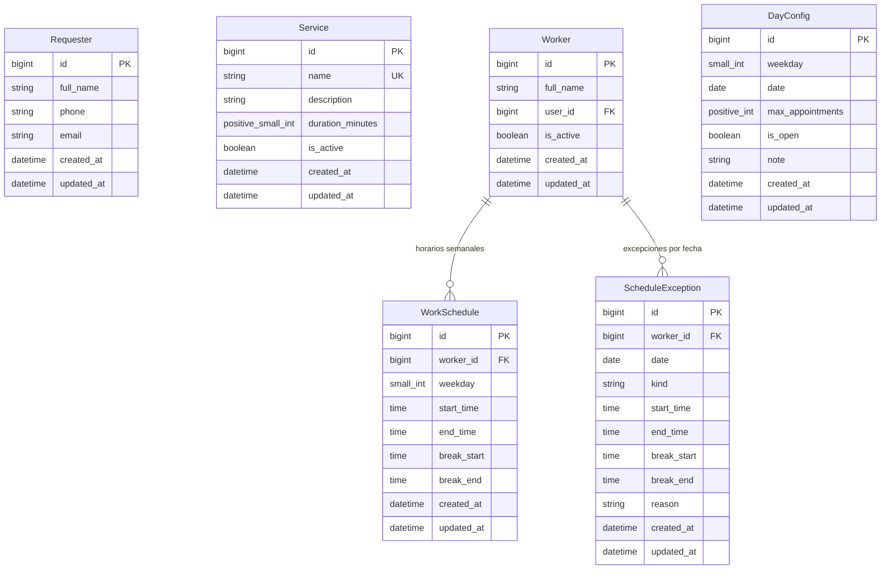

# Agenda de Citas (microapp Django)

Microapp para gestionar citas: apertura y cierre de agenda, cupos por día, asignación automática de personal, lista de espera, cancelación y reposición de fechas.

## Stack

- Python 3.12+, Django 5.x, Django REST Framework
- Gestión de entorno y dependencias: [uv](https://docs.astral.sh/uv/) (`pyproject.toml` + `uv.lock`)
- PostgreSQL (SQLite solo para desarrollo)
- Celery + Redis (opcional: reasignación de espera, recordatorios)
- pytest + pytest-django, ruff
- Zona horaria: `America/Mexico_City`

## Conceptos clave

| Concepto | Descripción |
|---|---|
| **Solicitante** | Persona que pide la cita (nombre, teléfono, correo). |
| **Servicio** | Tipo de cita con duración en minutos (**≤ 60**, configurable). |
| **Trabajador** | Personal que atiende. Tiene horario propio por día de la semana. |
| **Horario laboral** | Entrada, salida y descanso opcional por trabajador y día. |
| **Excepción de horario** | Ausencia, vacaciones o horario especial en una fecha concreta. |
| **Configuración de día** | Cupo máximo de citas y estado abierto/cerrado, por día de la semana (default) o por fecha (override). |
| **Cita** | Solicitante + servicio + fecha/hora + trabajador (puede ser nulo si está en espera). |
| **Lista de espera** | Citas sin trabajador disponible; se asignan por orden de llegada (FIFO). |

## Modelo de datos



### Reglas de validación e integridad en modelos

| Modelo | Regla / Constraint | Nivel | Descripción |
|---|---|---|---|
| **`Requester`** | `requester_phone_or_email_required` | `clean()` + `CheckConstraint` | Al menos uno de `phone` o `email` debe estar presente y no vacío. |
| **`Service`** | `service_duration_range` | `clean()` + `CheckConstraint` | `5 <= duration_minutes <= 60`. Nombre único en el catálogo. |
| **`Worker`** | `worker_profile` | `OneToOneField` | Un usuario Django puede vincularse a un solo trabajador. Borrado físico deshabilitado en Admin. |
| **`WorkSchedule`** | `unique_worker_weekday_schedule` | `UniqueConstraint` | Único por combinación `(worker, weekday)`. |
| **`WorkSchedule`** | `work_schedule_start_lt_end` | `clean()` + `CheckConstraint` | `start_time < end_time` (sin cruzar medianoche). |
| **`WorkSchedule`** | `work_schedule_break_all_or_nothing` | `clean()` + `CheckConstraint` | Descanso todo o nada (`break_start` y `break_end` ambos definidos o ambos nulos). |
| **`WorkSchedule`** | `work_schedule_break_within_shift` | `clean()` + `CheckConstraint` | `start_time <= break_start < break_end <= end_time`. |
| **`ScheduleException`** | `unique_worker_date_exception` | `UniqueConstraint` | Único por combinación `(worker, date)`. |
| **`ScheduleException`** | `schedule_exception_valid_structure` | `clean()` + `CheckConstraint` | `ABSENCE`: sin horas ni descansos. `SPECIAL_HOURS`: horas de turno obligatorias y descansos válidos dentro del turno. |
| **`DayConfig`** | `day_config_either_weekday_or_date` | `clean()` + `CheckConstraint` | Exactamente uno presente: `weekday` (default semanal) o `date` (override por fecha). |
| **`DayConfig`** | `unique_day_config_weekday` / `date` | `UniqueConstraint` condicional | Un único default por `weekday` y un único override por `date`. `max_appointments = 0` es válido. |

## Estados de la cita

```
SOLICITADA ──asignación──► CONFIRMADA ──► COMPLETADA
    │                          │
    │ (sin personal)           ├──► CANCELADA
    ▼                          ├──► NO_ASISTIO
  EN_ESPERA ──(se libera)──►   └──► REPROGRAMADA (enlaza a la nueva cita)
    │
    └──► CANCELADA / EXPIRADA
```

## Reglas de negocio

### 1. Apertura y cierre
- Cada día puede estar **abierto** o **cerrado** (`DayConfig.is_open`).
- Ventana de reserva: `BOOKING_MIN_ADVANCE_HOURS` (anticipación mínima) y `BOOKING_MAX_ADVANCE_DAYS` (máximo a futuro).
- Cerrar un día con citas existentes **no las borra**: se listan para reprogramar o cancelar.

### 2. Duración y capacidad
- La duración la define el servicio (`duration_minutes`, 5–60).
- Una cita no puede cruzar el descanso. Capacidad por trabajador en un día:

```
capacidad_trabajador = Σ floor(minutos_del_tramo / duración)  (por cada tramo continuo de trabajo)
capacidad_personal   = Σ capacidad_trabajador                (solo trabajadores activos y sin excepción)
cupo_efectivo        = min(DayConfig.max_appointments, capacidad_personal)
```

- Si `max_appointments` es nulo, solo aplica la capacidad del personal.
- Una cita se acepta solo si `citas_activas_del_día < cupo_efectivo`.

### 3. Asignación de personal
1. Se buscan trabajadores activos cuyo horario cubra `[inicio, fin)` y sin cita traslapada.
2. Se elige al de **menor carga del día** (desempate: el de menor id).
3. Si ninguno está libre → la cita queda `EN_ESPERA` (si no excede `WAITLIST_MAX_PER_DAY`).
4. La asignación corre dentro de `transaction.atomic()` con `select_for_update()` para evitar doble reserva.

### 4. Lista de espera
- Se reevalúa (FIFO) cuando: se cancela una cita, cambia un horario, se agrega personal o se aumenta el cupo.
- Las citas en espera expiran si llega la fecha sin asignarse (`EXPIRADA`).

### 5. Cancelación y reposición
- Solo se puede cancelar/reprogramar con `CANCEL_MIN_HOURS` de anticipación (configurable).
- Máximo `MAX_RESCHEDULES_PER_APPOINTMENT` reprogramaciones por cita.
- Reprogramar = crear nueva cita (pasa por las mismas validaciones) + marcar la anterior `REPROGRAMADA` con `rescheduled_to`. Si la nueva falla, la anterior se conserva.
- Todo cambio de estado queda en `AppointmentEvent` (auditoría).

### 6. Límites adicionales
- Máx. citas activas por solicitante por día: `MAX_ACTIVE_PER_REQUESTER_PER_DAY`.
- Sin traslape de citas del mismo solicitante.

### 7. Horarios del personal
- Se configuran por día de la semana (entrada, salida, descanso).
- Cambiar un horario **revalida** las citas futuras del trabajador: las que ya no caben se desasignan y vuelven a asignación/espera.
- Las excepciones por fecha tienen prioridad sobre el horario semanal.

## Estructura del proyecto

```
agenda/
├── models/            # Requester, Service, Worker, WorkSchedule, ScheduleException,
│                      # DayConfig, Appointment, AppointmentEvent
├── services/          # Casos de uso (toda la lógica de negocio)
│   ├── booking.py         # solicitar, confirmar
│   ├── assignment.py      # elegir trabajador, lista de espera
│   ├── capacity.py        # cálculo de cupos y disponibilidad
│   ├── cancellation.py    # cancelar, reprogramar
│   └── schedules.py       # cambios de horario y revalidación
├── selectors/         # Consultas de solo lectura (disponibilidad, agenda del día)
├── api/               # serializers, viewsets, urls (sin lógica de negocio)
├── tasks.py           # Celery: reasignar espera, expirar, recordatorios
├── admin.py
├── tests/
└── migrations/
```

## API (v1)

| Método | Ruta | Descripción |
|---|---|---|
| GET | `/api/v1/availability/?date=&service=` | Horarios libres y cupo restante |
| POST | `/api/v1/appointments/` | Solicitar cita (confirma o deja en espera) |
| GET | `/api/v1/appointments/{id}/` | Detalle |
| POST | `/api/v1/appointments/{id}/cancel/` | Cancelar |
| POST | `/api/v1/appointments/{id}/reschedule/` | Reprogramar |
| GET/PUT | `/api/v1/day-configs/{date}/` | Cupo y apertura/cierre del día |
| GET/PUT | `/api/v1/workers/{id}/schedule/` | Horario del trabajador |
| POST | `/api/v1/workers/{id}/exceptions/` | Ausencia o día especial |
| GET | `/api/v1/waitlist/?date=` | Citas en espera |

### Detalle de Disponibilidad (`GET /api/v1/availability/`)

Parámetros requeridos: `date` (`YYYY-MM-DD`) y `service` (`id` entero).

**Ejemplo de respuesta (`200 OK`):**

```json
{
  "date": "2026-10-12",
  "service": {
    "id": 1,
    "name": "Consulta General",
    "duration_minutes": 30
  },
  "is_open": true,
  "reason": null,
  "effective_quota": 20,
  "remaining_quota": 20,
  "slots": [
    {
      "start": "2026-10-12T09:00:00-06:00",
      "end": "2026-10-12T09:30:00-06:00",
      "free_workers": 2
    }
  ]
}
```

#### Motivos (`reason`) cuando no hay horarios disponibles

| `reason` | Condición |
|---|---|
| `OUT_OF_WINDOW` | La fecha es anterior a hoy o posterior a `hoy + BOOKING_MAX_ADVANCE_DAYS`. |
| `DAY_CLOSED` | La configuración del día (`DayConfig.is_open`) es `False`. |
| `NO_STAFF` | La capacidad agregada del personal para esa duración es `0` (o no hay personal). |
| `QUOTA_FULL` | `remaining_quota <= 0` (incluye cuando `DayConfig.max_appointments = 0`). |
| `NO_SLOTS` | Hay cupo disponible pero ningún horario libre (todos ocupados o pasados por anticipación mínima). |
| `null` | Hay al menos un horario libre disponible. |

#### Puerto de ocupación (`BusySlotsPort`)

El cálculo de disponibilidad y slots se encuentra desacoplado de las citas existentes mediante el protocolo `BusySlotsPort` ([agenda/ports.py](file:///home/raulantodev/Projects/microapps/gestor-citas/agenda/ports.py)). En la Fase 2 opera con `NullBusySlots` (todo disponible), preparando la inyección del adaptador real con el modelo `Appointment` en la Fase 3.


## Configuración (`settings` / variables de entorno)

| Variable | Default | Descripción |
|---|---|---|
| `BOOKING_MIN_ADVANCE_HOURS` | 2 | Anticipación mínima para agendar |
| `BOOKING_MAX_ADVANCE_DAYS` | 60 | Máximo de días a futuro |
| `CANCEL_MIN_HOURS` | 4 | Anticipación mínima para cancelar/reprogramar |
| `MAX_RESCHEDULES_PER_APPOINTMENT` | 2 | Reprogramaciones permitidas |
| `MAX_ACTIVE_PER_REQUESTER_PER_DAY` | 1 | Citas activas por solicitante/día |
| `WAITLIST_MAX_PER_DAY` | 20 | Tope de espera por día |
| `DEFAULT_SLOT_STEP_MINUTES` | 15 | Granularidad de horarios ofrecidos |

## Puesta en marcha

### Crear el proyecto desde cero

```bash
uv init agenda-citas --app && cd agenda-citas
uv add django djangorestframework psycopg[binary] python-decouple
uv add --dev pytest pytest-django factory-boy freezegun ruff
# opcional: uv add celery redis
uv run django-admin startproject config .
uv run python manage.py startapp agenda
```

### Base de datos local (PostgreSQL con Docker)

```bash
docker compose up -d db
```

### Clonar y ejecutar

```bash
uv sync                      # crea .venv e instala desde uv.lock
cp .env.example .env
docker compose up -d db      # levanta PostgreSQL
uv run python manage.py migrate
uv run python manage.py createsuperuser
uv run python manage.py runserver
```

El endpoint de salud estará disponible en:
`GET http://localhost:8000/api/v1/health/` -> `{"status": "ok"}`


### Tests y calidad

```bash
uv run pytest
uv run ruff check . && uv run ruff format --check .
```

> Dependencias: `uv add <paquete>` (o `uv add --dev <paquete>`). No usar `pip install` ni editar `uv.lock` a mano.

## Casos de prueba mínimos

- Cupo diario lleno → rechaza o manda a espera según configuración.
- Sin trabajadores libres → `EN_ESPERA`; al cancelar otra cita, se asigna FIFO.
- Dos solicitudes simultáneas al último cupo → solo una se confirma.
- Cambio de horario del trabajador → revalida citas futuras.
- Reprogramar falla → la cita original queda intacta.
- Duración > 60 min → error de validación.

## Roadmap

- Notificaciones (correo/WhatsApp) y recordatorios
- Múltiples sedes/recursos (consultorios)
- Servicios con trabajadores específicos (habilidades)
- Portal público para el solicitante