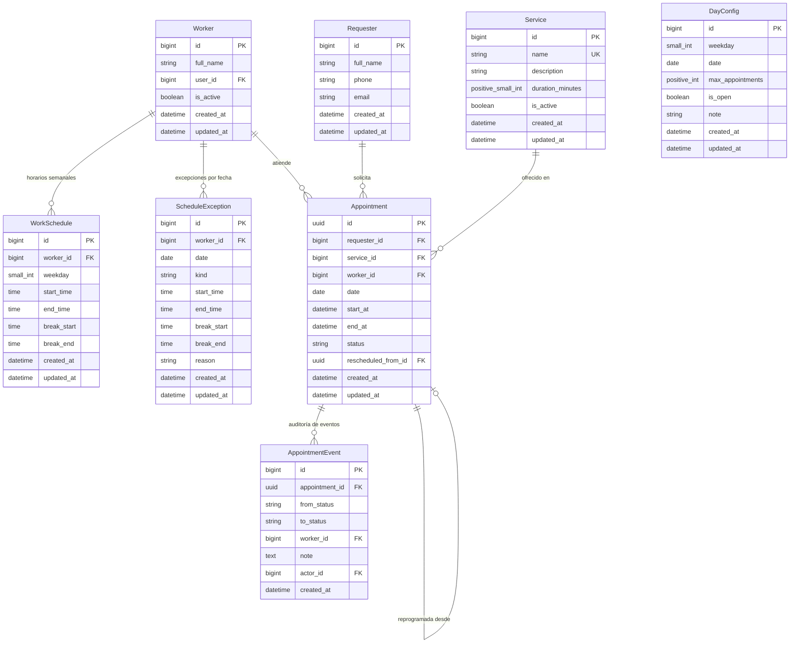

# Agenda de Citas (microapp Django)

Microapp para gestionar citas: apertura y cierre de agenda, cupos por día, asignación automática de personal, lista de espera, cancelación y reposición de fechas.

## Stack

- Python 3.12+, Django 5.x / 6.x, Django REST Framework
- Gestión de entorno y dependencias: [uv](https://docs.astral.sh/uv/) (`pyproject.toml` + `uv.lock`)
- PostgreSQL (SQLite para pruebas unitarias locales)
- Celery + Redis (opcional: reasignación de espera, recordatorios)
- pytest + pytest-django, ruff
- Zona horaria: `America/Mexico_City`

## Conceptos clave

| Concepto | Descripción |
|---|---|
| **Solicitante** | Persona que pide la cita (nombre, teléfono normalizado, correo). |
| **Servicio** | Tipo de cita con duración en minutos (**≤ 60**, configurable). |
| **Trabajador** | Personal que atiende. Tiene horario propio por día de la semana. |
| **Horario laboral** | Entrada, salida y descanso opcional por trabajador y día. |
| **Excepción de horario** | Ausencia, vacaciones o horario especial en una fecha concreta. |
| **Configuración de día** | Cupo máximo de citas y estado abierto/cerrado, por día de la semana (default) o por fecha (override). |
| **Cita** | Solicitante + servicio + fecha/hora + trabajador (nulo si está en espera). Identificador UUID v4. |
| **Evento de Cita** | Registro inmutable de auditoría para cada transición de estado de una cita. |
| **Lista de espera** | Citas sin trabajador disponible; se asignan por orden de llegada (FIFO). |

## Modelo de datos



### Reglas de validación e integridad en modelos

| Modelo | Regla / Constraint | Nivel | Descripción |
|---|---|---|---|
| **`Requester`** | `requester_phone_or_email_required` | `clean()` + `CheckConstraint` | Al menos uno de `phone` o `email` debe estar presente y no vacío. |
| **`Service`** | `service_duration_range` | `clean()` + `CheckConstraint` | `5 <= duration_minutes <= 60`. Nombre único en el catálogo. |
| **`Worker`** | `worker_profile` | `OneToOneField` | Un usuario Django puede vincularse a un solo trabajador. Borrado físico deshabilitado en Admin. |
| **`WorkSchedule`** | `unique_worker_weekday_schedule` | `UniqueConstraint` | Único por combinación `(worker, weekday)`. |
| **`WorkSchedule`** | `work_schedule_start_lt_end` | `clean()` + `CheckConstraint` | `start_time < end_time` (sin cruzar medianoche). |
| **`WorkSchedule`** | `work_schedule_break_all_or_nothing` | `clean()` + `CheckConstraint` | Descanso todo o nada (`break_start` y `break_end` ambos definidos o ambos nulos). |
| **`WorkSchedule`** | `work_schedule_break_within_shift` | `clean()` + `CheckConstraint` | `start_time <= break_start < break_end <= end_time`. |
| **`ScheduleException`** | `unique_worker_date_exception` | `UniqueConstraint` | Único por combinación `(worker, date)`. |
| **`ScheduleException`** | `schedule_exception_valid_structure` | `clean()` + `CheckConstraint` | `ABSENCE`: sin horas ni descansos. `SPECIAL_HOURS`: horas de turno obligatorias y descansos válidos. |
| **`DayConfig`** | `day_config_either_weekday_or_date` | `clean()` + `CheckConstraint` | Exactamente uno presente: `weekday` (default) o `date` (override). |
| **`DayConfig`** | `unique_day_config_weekday` / `date` | `UniqueConstraint` condicional | Un único default por `weekday` y un único override por `date`. |
| **`Appointment`** | `appointment_end_gt_start` | `clean()` + `CheckConstraint` | `end_at > start_at`. |
| **`Appointment`** | `appointment_confirmed_has_worker` | `clean()` + `CheckConstraint` | `CONFIRMED` requiere `worker` no nulo. |
| **`Appointment`** | `appointment_waitlisted_no_worker` | `clean()` + `CheckConstraint` | `WAITLISTED` requiere `worker` nulo. |
| **`Appointment`** | `appointment_exclude_overlapping_worker` | `PostgresExclusionConstraint` | PostgreSQL `ExclusionConstraint` con `BtreeGistExtension` impidiendo solape `(worker =, tstzrange(start_at, end_at) &&)` para estados en `OCCUPYING_STATUSES`. |
| **`AppointmentEvent`** | Inserción append-only | `admin` + `models` | Registro inmutable de cada cambio de estado. |

## Estados de la cita y consumo de recursos

```
SOLICITADA ──asignación──► CONFIRMADA ──► COMPLETADA
    │                          │
    │ (sin personal)           ├──► CANCELADA
    ▼                          ├──► NO_SHOW
  EN_ESPERA ──(se libera)──►   └──► REPROGRAMADA (enlaza a la nueva cita)
    │
    └──► CANCELADA / EXPIRADA
```

### Tabla de consumo de cupo y ocupación de personal

| Estado (`AppointmentStatus`) | Consume Cupo Diario (`QUOTA_STATUSES`) | Ocupa Tiempo de Personal (`OCCUPYING_STATUSES`) | Cita Activa de Solicitante (`ACTIVE_STATUSES`) |
|---|---|---|---|
| `REQUESTED` | No | No | No |
| `CONFIRMED` | **Sí** | **Sí** | **Sí** |
| `WAITLISTED` | **Sí** | No (sin trabajador) | **Sí** |
| `COMPLETED` | **Sí** | **Sí** | No |
| `NO_SHOW` | **Sí** | **Sí** | No |
| `CANCELLED` | No | No | No |
| `RESCHEDULED` | No | No | No |
| `EXPIRED` | No | No | No |

> **Nota:** Que `WAITLISTED` consuma cupo garantiza que cuando la cita sea asignada a un trabajador liberado, siempre tenga lugar garantizado en el cupo efectivo del día.

## Reglas de negocio

### 1. Apertura, ventana y solicitantes
- Cada día puede estar **abierto** o **cerrado** (`DayConfig.is_open`).
- Ventana de reserva: `BOOKING_MIN_ADVANCE_HOURS` (anticipación mínima) y `BOOKING_MAX_ADVANCE_DAYS` (máximo a futuro).
- **Identificación del solicitante:** Se identifica por teléfono normalizado (solo dígitos; remueve prefijo `52` si quedan 12 dígitos) o por correo electrónico en minúsculas. Si ya existe un registro con ese teléfono o correo, se reutiliza sin sobrescribir su nombre.
- Límite diario por solicitante: `MAX_ACTIVE_PER_REQUESTER_PER_DAY` citas activas (`CONFIRMED`, `WAITLISTED`) por fecha; no se permiten citas traslapadas para el mismo solicitante.

### 2. Duración y capacidad
- La duración la define el servicio (`duration_minutes`, 5–60 min).
- Una cita no puede cruzar el descanso. Capacidad por trabajador en un día:

```
capacidad_trabajador = Σ floor(minutos_del_tramo / duración)  (por cada tramo continuo de trabajo)
capacidad_personal   = Σ capacidad_trabajador                (solo trabajadores activos y sin excepción)
cupo_efectivo        = min(DayConfig.max_appointments, capacidad_personal)
```

- Si `max_appointments` es nulo, solo aplica la capacidad del personal.
- Una cita se acepta solo si `citas_que_consumen_cupo < cupo_efectivo`.

### 3. Asignación de personal y concurrencia
1. Se buscan trabajadores con turno que cubran `[inicio, fin)` sin cruzar descanso y sin cita que ocupe su tiempo en ese intervalo.
2. Se elige al trabajador de **menor carga del día** (citas en `OCCUPYING_STATUSES`); en caso de empate, el de menor `id`.
3. Si ningún trabajador está libre → la cita se crea como `WAITLISTED` sin trabajador asignado (salvo si se superó `WAITLIST_MAX_PER_DAY`, en cuyo caso lanza `WaitlistFull`).
4. **Concurrencia:** Todo el proceso de reserva corre dentro de `transaction.atomic()`. Para evitar carreras por el cupo o doble asignación incluso sin fila previa de `DayConfig`, se toma un lock consultivo a nivel de transacción en PostgreSQL `pg_advisory_xact_lock(42, date.toordinal())`. Adicionalmente, el `PostgresExclusionConstraint` actúa como red de seguridad en BD.

### 4. Lista de espera (FIFO) y Reasignación Automática
- **FIFO estricto sin bloqueo de cabecera:** Las citas en espera se evalúan por orden de llegada (`created_at, id`). Si la primera de la fila no puede asignarse (porque su horario particular sigue ocupado), **no frena** a las siguientes solicitudes con otros horarios libres.
- **Promover no cambia el cupo consumido:** Tanto `WAITLISTED` como `CONFIRMED` computan en `QUOTA_STATUSES`. Al asignarse personal a una cita en espera, no se recalcula `QuotaExceeded`. Por lo tanto, **subir el cupo no libera citas en espera**.
- **Único punto de entrada:** `process_waitlist(date)` en `agenda/services/waitlist.py` centraliza toda la lógica de asignación con lock consultivo por día (`day_advisory_lock`).

#### Disparadores de reasignación

| Evento disparador | Mecanismo | Efecto |
|---|---|---|
| **Cancelación de cita** | Fase 5 service | Libera intervalo del trabajador y ejecuta `process_waitlist(date)`. |
| **Reprogramación de cita** | Fase 5 service | Libera horario anterior y ejecuta `process_waitlist(date)`. |
| **Alta o activación de personal (`Worker`)** | Admin / Service | `schedule_waitlist_processing()` encola reasignación asíncrona. |
| **Cambio de horario (`WorkSchedule`)** | Admin / Service | Amplía tramos laborales y dispara `process_waitlist`. |
| **Eliminación de ausencia (`ScheduleException`)** | Admin / Service | Restablece disponibilidad del trabajador y reasigna citas. |
| **Reapertura de día (`DayConfig.is_open=True`)** | Admin / Service | Habilita el día y asigna citas pendientes en espera. |
| **Barrido periódico (Celery Beat)** | Celery Beat | Ejecuta `waitlist_maintenance_task` cada `WAITLIST_SWEEP_MINUTES`. |

> **Nota:** Subir el cupo (`DayConfig.max_appointments`) **no** dispara reasignación porque las citas en lista de espera ya consumieron cupo en su reserva original.

- **Expiración automática:** Si llega la fecha y hora de inicio (`start_at <= now`) de una cita `WAITLISTED` sin haberse asignado a un trabajador, el servicio `expire_waitlist()` la marca como `EXPIRED` con su respectivo `AppointmentEvent`. Las citas expiradas dejan de consumir cupo.

### 5. Auditoría
- Todo cambio de estado crea obligatoriamente un registro `AppointmentEvent` inmutable (`appointment`, `from_status`, `to_status`, `worker`, `note`, `actor`).
- Prohibido modificar `status` o `worker` fuera de las funciones en `agenda/services/`.

### 6. Cambios de horario del personal y revalidación
- **Punto de entrada único:** `revalidate_worker(worker_id)` en `agenda/services/schedules.py` centraliza la revalidación tras modificar horarios semanales, excepciones de fecha o el estado activo de un personal.
- **Revalidación exclusiva de citas futuras:** Solo se evalúan citas en estado `CONFIRMED` con `start_at > now`. Las citas pasadas o en curso no se modifican.
- **Prioridad de resolución de citas desplazadas:**
  1. **Reasignación a otro trabajador libre:** Mediante `reassign_worker()` se busca otro trabajador disponible con menor carga (manteniendo estado `CONFIRMED` y registrando evento `CONFIRMED -> CONFIRMED` con el nuevo trabajador).
  2. **Paso a lista de espera:** Si no hay trabajador libre, la cita transiciona a `WAITLISTED` (`worker=None`) mediante `transition(..., via_revalidation=True)` conservando su `created_at` original para mantener su prioridad FIFO y saltándose el tope `WAITLIST_MAX_PER_DAY`.
  3. **Citas inatendibles:** Citas en espera que ya no caben en ningún tramo de ningún trabajador son detectadas con `list_unserviceable_waitlist()` y filtrables en la API (`?unserviceable=true`) para resolución manual por staff.
- **Sobrecupo:** Si una reducción de horario reduce el cupo efectivo por debajo de las citas activas existentes, no se cancela ninguna cita. El día se marca como `over_quota` y se impiden nuevas reservas (`remaining_quota = 0`).
- **Confirmación obligatoria y Dry-Run:**
  - Cambios con impacto sin `confirm=true` → error `409 Conflict` (`SCHEDULE_CHANGE_REQUIRES_CONFIRMATION`) con el desglose de `impact` y reversión total.
  - Con `dry_run=true` → retorna `200 OK` con `{"applied": false, "impact": {...}}` sin modificar la base de datos.
  - Cambios sin citas afectadas se aplican de forma inmediata.
- **Barrido periódico y comando de gestión:** Celery Beat ejecuta periódicamente `waitlist_maintenance_task` en orden: `expire_waitlist` → `revalidate_all` → `process_waitlist_all`. También disponible mediante el comando `revalidate_assignments [--worker ID]`.

## Roles y permisos

La API opera bajo el principio de **denegar por defecto** (`DEFAULT_PERMISSION_CLASSES = [IsAuthenticated]`) con JWT (`djangorestframework-simplejwt`). Las únicas rutas públicas declaran explícitamente `AllowAny` y forman parte de una lista blanca verificada por pruebas automatizadas.

### Roles efectivos

1. **Solicitante (Anónimo con Token):** No requiere cuenta. Gestiona su cita enviando su token de gestión en el encabezado `X-Manage-Token`.
2. **Trabajador (`WORKER`):** Usuario Django autenticado con perfil `Worker` vinculado y activo (`Worker.is_active=True`). Gestiona su horario, excepciones, agenda diaria (`/me/agenda/`) y transiciones de citas que tiene asignadas.
3. **Staff (`STAFF`):** Usuario con `is_staff=True` o `is_superuser=True`. Control total sobre configuraciones de día, personal, rotación de tokens, cancelación forzada y visualización completa. Si un usuario es staff y trabajador a la vez, su rol es `STAFF` y conserva su `worker_id`.
4. **Sin Rol (`NONE`):** Usuario autenticado sin `is_staff` y sin `Worker` activo asignado. Recibe `403 Forbidden` en todos los endpoints protegidos.

### Matriz de permisos

| Endpoint / Operación | Público | Solicitante (`X-Manage-Token`) | Trabajador (`WORKER`) | Staff (`STAFF`) |
|---|---|---|---|---|
| `GET /api/v1/health/` | ✅ | ✅ | ✅ | ✅ |
| `GET /api/v1/availability/` | ✅ | ✅ | ✅ | ✅ |
| `POST /api/v1/appointments/` | ✅ | ✅ | ✅ | ✅ |
| `GET /api/v1/appointments/{id}/` | ❌ (401/404) | ✅ Su cita | ✅ Solo sus citas asignadas | ✅ Todas |
| `POST /api/v1/appointments/{id}/cancel/` | ❌ (401/404) | ✅ Su cita | ❌ (403) | ✅ (con `force`) |
| `POST /api/v1/appointments/{id}/reschedule/` | ❌ (401/404) | ✅ Su cita | ❌ (403) | ✅ (con `force`) |
| `POST /api/v1/appointments/{id}/complete/` | ❌ (401/404) | ❌ (403/404) | ✅ Solo sus citas asignadas | ✅ |
| `POST /api/v1/appointments/{id}/no-show/` | ❌ (401/404) | ❌ (403/404) | ✅ Solo sus citas asignadas | ✅ |
| `POST /api/v1/appointments/{id}/token/` | ❌ (401) | ❌ (403) | ❌ (403) | ✅ |
| `GET /api/v1/appointments/` (`?unserviceable=true`) | ❌ (401) | ❌ (403) | ❌ (403) | ✅ |
| `GET /api/v1/waitlist/` | ❌ (401) | ❌ (403) | ❌ (403) | ✅ |
| `GET /api/v1/me/agenda/?date=` | ❌ (401) | ❌ (403) | ✅ Su propia agenda | ✅ Con `worker_id` |
| `GET/PUT /api/v1/workers/{id}/schedule/` | ❌ (401) | ❌ (403) | ✅ Solo su propio perfil | ✅ |
| `POST/DELETE /api/v1/workers/{id}/exceptions/`| ❌ (401) | ❌ (403) | ✅ Solo su propio perfil | ✅ |
| `PATCH /api/v1/workers/{id}/` (`is_active`) | ❌ (401) | ❌ (403) | ❌ (403) | ✅ |
| `GET/PUT /api/v1/day-configs/...` | ❌ (401) | ❌ (403) | ❌ (403) | ✅ |
| `POST /api/v1/auth/token/` | ✅ | ✅ | ✅ | ✅ |
| `POST /api/v1/auth/token/refresh/` | ✅ | ✅ | ✅ | ✅ |
| `POST /api/v1/auth/logout/` | ✅ | ✅ | ✅ | ✅ |
| `GET /api/v1/auth/me/` | ❌ (401) | ❌ (401) | ✅ | ✅ |

---

## Autenticación (JWT)

La autenticación de la API utiliza tokens JWT (`Bearer <access_token>`). Las sesiones de cookies quedan reservadas exclusivamente para el panel de administración de Django.

### 1. Iniciar sesión (`POST /api/v1/auth/token/`)

```bash
curl -X POST http://localhost:8000/api/v1/auth/token/ \
  -H "Content-Type: application/json" \
  -d '{
    "username": "dra.ana",
    "password": "Password123!"
  }'
```

**Respuesta (`200 OK`):**
```json
{
  "access": "eyJhbGciOiJIUzI1NiIsIn...",
  "refresh": "eyJhbGciOiJIUzI1NiIsIn..."
}
```

> **Protección ante fuerza bruta:** Tras 5 intentos fallidos para un mismo usuario, se bloquea por 15 minutos respondiendo `429 Too Many Requests` (`LOGIN_LOCKED`) con cabecera `Retry-After`. La respuesta a credenciales inválidas siempre es uniforme (`INVALID_CREDENTIALS`), exista o no el usuario.

### 2. Refrescar token con rotación (`POST /api/v1/auth/token/refresh/`)

```bash
curl -X POST http://localhost:8000/api/v1/auth/token/refresh/ \
  -H "Content-Type: application/json" \
  -d '{
    "refresh": "eyJhbGciOiJIUzI1NiIsIn..."
  }'
```

**Respuesta (`200 OK`):**
```json
{
  "access": "eyJhbGciOiJIUzI1NiIsIn...",
  "refresh": "eyJhbGciOiJIUzI1NiIsIn..."
}
```

### 3. Cerrar sesión / Lista negra (`POST /api/v1/auth/logout/`)

Coloca el `refresh` token en la lista negra, impidiendo refrescos posteriores:

```bash
curl -X POST http://localhost:8000/api/v1/auth/logout/ \
  -H "Content-Type: application/json" \
  -d '{
    "refresh": "eyJhbGciOiJIUzI1NiIsIn..."
  }'
```

**Respuesta:** `204 No Content`.

### 4. Consultar perfil actual (`GET /api/v1/auth/me/`)

```bash
curl -X GET http://localhost:8000/api/v1/auth/me/ \
  -H "Authorization: Bearer <access_token>"
```

**Respuesta (`200 OK`):**
```json
{
  "id": 2,
  "username": "dra.ana",
  "role": "WORKER",
  "worker_id": 1
}
```

---

## Token de gestión del solicitante

Para evitar exponer UUIDs como credenciales en logs y navegadores:

1. **Emisión única:** Al crear una cita (`POST /api/v1/appointments/`) o reprogramarla (`POST /api/v1/appointments/{id}/reschedule/`), la respuesta entrega un `manage_token` seguro (`secrets.token_urlsafe(32)`).
2. **Almacenamiento seguro:** El token en texto claro **nunca se persiste en la base de datos ni se escribe en logs**. Solo se almacena su hash SHA-256 (`manage_token_hash`).
3. **Uso en cabecera:** El solicitante incluye el encabezado `X-Manage-Token: <token>` al consultar, cancelar o reprogramar su cita.
4. **Prevención de enumeración:** Si no se proporciona un token válido, el endpoint responde `404 Not Found` (`APPOINTMENT_NOT_FOUND`) sin distinguir si la cita no existe o si el token es incorrecto.
5. **Rotación por Staff:** Si el solicitante extravía su token, un usuario Staff puede rotarlo con `POST /api/v1/appointments/{id}/token/`, lo que genera un nuevo token e invalida el anterior registrando un evento de auditoría.

---

## Privacidad de datos por rol

Los endpoints de citas filtran la información personal del solicitante según el rol:
- **Solicitante (con token):** Solo recibe nombre (`full_name`) y ID; no expone teléfono ni correo.
- **Trabajador:** Recibe nombre y teléfono del solicitante únicamente en sus citas asignadas para contacto operativo.
- **Staff:** Acceso a todos los datos de contacto (`full_name`, `phone`, `email`).

---

## Estructura del proyecto

```
agenda/
├── adapters/          # Adaptadores externos (AppointmentBusySlots que implementa BusySlotsPort)
├── api/               # Serializers, views delgadas, urls, permissions, roles, auth
├── exceptions.py      # Excepciones de dominio tipadas con código y http_status
├── management/        # Comandos administrativos (seed_demo, process_waitlist, expire_waitlist, revalidate_assignments)
├── models/            # Requester, Service, Worker, WorkSchedule, ScheduleException,
│                      # DayConfig, Appointment, AppointmentEvent
├── ports.py           # Protocolo BusySlotsPort y NullBusySlots
├── selectors/         # Consultas de solo lectura (get_day_availability, get_appointment, list_waitlist, schedules, appointments)
├── services/          # Casos de uso (booking, waitlist, assignment, capacity, schedules, cancellation, locks, manage_token, requesters)
├── tasks.py           # Tareas Celery (process_waitlist_task, waitlist_maintenance_task)
├── admin.py           # Admin de Django (Appointment sólo lectura, WaitlistTriggerMixin)
├── tests/             # Tests unitarios, de integración, de roles, autenticación y concurrencia
└── migrations/        # Migraciones versionadas (incluye BtreeGistExtension)
```

## API (v1)

| Método | Ruta | Permiso | Descripción |
|---|---|---|---|
| GET | `/api/v1/health/ready/` | Público | Verificación de dependencias (DB y Caché) |
| GET | `/api/v1/schema/` | Público (si docs activos) | Contrato OpenAPI YAML/JSON |
| GET | `/api/v1/docs/` | Público (si docs activos) | Documentación interactiva Swagger UI |
| GET | `/api/v1/appointments/` | Staff | Listado paginado de citas con filtros y ordenamiento |
| GET | `/api/v1/availability/?date=&service=` | Público | Horarios libres y cupo restante |
| POST | `/api/v1/appointments/` | Público | Solicitar cita (devuelve `manage_token` una sola vez) |
| GET | `/api/v1/appointments/{id}/` | Solicitante (`X-Manage-Token`) / Trabajador (asignada) / Staff | Detalle de cita (datos del solicitante según rol) |
| POST | `/api/v1/appointments/{id}/cancel/` | Solicitante (`X-Manage-Token`) / Staff | Cancelar cita (`force` disponible para staff) |
| POST | `/api/v1/appointments/{id}/reschedule/` | Solicitante (`X-Manage-Token`) / Staff | Reprogramar cita (devuelve nuevo `manage_token`) |
| POST | `/api/v1/appointments/{id}/complete/` | Trabajador (asignada) / Staff | Marcar cita como completada |
| POST | `/api/v1/appointments/{id}/no-show/` | Trabajador (asignada) / Staff | Marcar cita como inasistencia |
| POST | `/api/v1/appointments/{id}/token/` | Staff | Rota el token de gestión y lo entrega una sola vez |
| GET | `/api/v1/waitlist/?date=YYYY-MM-DD` | Staff | Lista FIFO de citas en espera con posición |
| GET | `/api/v1/me/agenda/?date=YYYY-MM-DD` | Trabajador (propia) / Staff (`worker_id` req) | Citas confirmadas de un trabajador en una fecha |
| GET | `/api/v1/workers/{id}/schedule/` | Staff / Trabajador propio | Horario semanal y excepciones futuras |
| PUT | `/api/v1/workers/{id}/schedule/` | Staff / Trabajador propio | Reemplaza horario semanal (soporta `confirm`, `dry_run`) |
| POST | `/api/v1/workers/{id}/exceptions/` | Staff / Trabajador propio | Crea ausencia u horario especial (soporta `confirm`, `dry_run`) |
| DELETE | `/api/v1/workers/{id}/exceptions/{exc_id}/` | Staff / Trabajador propio | Elimina una excepción de horario |
| PATCH | `/api/v1/workers/{id}/` | Staff | Activa o desactiva trabajador (`is_active`, `confirm`, `dry_run`) |
| GET | `/api/v1/day-configs/{date}/` | Staff | Configuración del día y resumen de cupos/ocupación |
| PUT | `/api/v1/day-configs/{date}/` | Staff | Actualiza cupo y apertura (`is_open`, `max_appointments`, `note`) |
| GET/PUT | `/api/v1/day-configs/weekday/{0-6}/` | Staff | Configuración por defecto por día de la semana |
| POST | `/api/v1/auth/token/` | Público | Obtener tokens JWT (`access` y `refresh`) con usuario y contraseña |
| POST | `/api/v1/auth/token/refresh/` | Público | Refrescar `access` token con rotación de `refresh` |
| POST | `/api/v1/auth/logout/` | Público | Invalida el `refresh` token en lista negra |
| GET | `/api/v1/auth/me/` | Autenticado | Perfil del usuario autenticado actual |

---

## Límites de uso (Rate Limiting)

La API aplica límites de tasa mediante throttling de DRF utilizando la caché compartida (Redis en producción).

| Alcance | Tasa por defecto | Identificador / Clave | Endpoints afectados |
|---|---|---|---|
| `availability` | `60/min` | IP del cliente | `GET /api/v1/availability/` |
| `booking` | `10/min`, `5/hour` | IP del cliente | `POST /api/v1/appointments/` |
| `booking_contact` | `3/hour` | Hash SHA-256 del contacto normalizado | `POST /api/v1/appointments/` |
| `manage` | `20/min` | IP del cliente | Acceso con token de gestión (`GET/POST /appointments/{id}/...`) |
| `auth` | `10/min` | IP del cliente | `POST /auth/token/`, `/refresh/`, `/logout/` |
| `user` | `120/min` | ID del usuario autenticado | Endpoints autenticados de Staff y Trabajadores |

- Los endpoints de salud (`/health/`, `/health/ready/`) no tienen límite de tasa en la aplicación.
- Las claves de caché **nunca** almacenan datos personales en claro (utilizan hash SHA-256 del contacto).
- Al exceder un límite, la API responde `429 Too Many Requests` con el formato estándar `{"code": "THROTTLED", "detail": "..."}` y el encabezado `Retry-After`.

---

## Logging estructurado y privacidad

- **Formato estándar JSON**: Cada solicitud HTTP genera una única línea JSON en `stdout` (`ts`, `level`, `request_id`, `method`, `path`, `status`, `duration_ms`, `user_id`, `role`).
- **Trazabilidad (`X-Request-ID`)**: Genera o propaga identificadores de solicitud seguros a través de middleware y `contextvars`.
- **Filtro de redacción de PII (`PIIRedactionFilter`)**: Enmascara teléfonos, correos electrónicos, tokens JWT, encabezados de autorización y datos confidenciales en mensajes de log, argumentos y diccionarios de contexto.
- **Eventos de dominio (`log_event`)**: Registro explícito de eventos operativos (`appointment_booked`, `appointment_cancelled`, `waitlist_assigned`, `requesters_anonymized`, etc.) únicamente con identificadores numéricos o UUIDs.

---

## Paginación y filtros

Los listados soportan paginación mediante `limit` y `offset` (por defecto 25 elementos, máximo 100).

- **`GET /api/v1/appointments/` (Staff):**
  - `date`: Fecha exacta (`YYYY-MM-DD`).
  - `date_from` y `date_to`: Rango de fechas (máximo 92 días de diferencia).
  - `status`: Uno o múltiples estados (`CONFIRMED`, `WAITLISTED`, `CANCELLED`, etc.).
  - `worker`: ID del trabajador asignado.
  - `service`: ID del servicio.
  - `unserviceable`: Booleano (`true` o `false`) para listar citas en espera inatendibles.
  - `ordering`: Ordenamiento por `start_at`, `-start_at`, `created_at`, `-created_at`.

- **`GET /api/v1/waitlist/?date=YYYY-MM-DD` (Staff):**
  - Lista de espera paginada preservando la posición **absoluta** del solicitante en la jornada (`position`).

---

## OpenAPI y Documentación interactiva

- **Contrato OpenAPI**: Especificación versionada y validada en [`openapi.yaml`](file:///home/raulantodev/Projects/microapps/gestor-citas/openapi.yaml).
- **Regeneración y validación**:
  ```bash
  uv run python manage.py spectacular --file openapi.yaml --validate --fail-on-warn
  ```
- **Explorador Swagger UI**: Disponible en `/api/v1/docs/` y esquema crudo en `/api/v1/schema/` cuando `API_DOCS_ENABLED=True`.

---

## Salud (`health` vs `ready`)

- `GET /api/v1/health/`: Sondeo de **vivacidad (liveness)**. Confirma que el proceso web está respondiendo (200 OK).
- `GET /api/v1/health/ready/`: Sondeo de **disponibilidad (readiness)**. Verifica la conectividad con la base de datos y la caché Redis. Si algún servicio falla, responde `503 Service Unavailable` con `{"status": "unavailable", "failing": ["database" | "cache"]}` sin filtrar datos internos.

---

## Retención y anonimización de datos

Política de privacidad y anonimización conforme a normativas de retención de datos personales:
- Se conservan las citas y métricas históricas, vaciando el nombre, teléfono y correo del solicitante y registrando `anonymized_at`.
- Solo se anonimizan solicitantes cuyas citas sean terminales (`CANCELLED`, `COMPLETED`, `NO_SHOW`, `EXPIRED`, `RESCHEDULED`) y finalizadas hace más de `PII_RETENTION_DAYS` (default 730 días / 2 años), o sin citas y creados hace más de dicho plazo.

```bash
# Simular anonimización (dry-run)
uv run python manage.py anonymize_requesters --older-than-days 730 --dry-run

# Ejecutar anonimización
uv run python manage.py anonymize_requesters --older-than-days 730
```

---

## Configuración (`settings` / variables de entorno)

| Variable | Default | Descripción |
|---|---|---|
| `BOOKING_MIN_ADVANCE_HOURS` | 2 | Anticipación mínima para agendar (horas) |
| `BOOKING_MAX_ADVANCE_DAYS` | 60 | Máximo de días a futuro para agendar |
| `CANCEL_MIN_HOURS` | 4 | Anticipación mínima para cancelar/reprogramar |
| `MAX_RESCHEDULES_PER_APPOINTMENT` | 2 | Reprogramaciones permitidas por cita |
| `MAX_ACTIVE_PER_REQUESTER_PER_DAY` | 1 | Citas activas por solicitante/día |
| `WAITLIST_MAX_PER_DAY` | 20 | Tope de citas en espera por día |
| `DEFAULT_SLOT_STEP_MINUTES` | 15 | Granularidad de horarios ofrecidos (minutos) |
| `WAITLIST_SWEEP_MINUTES` | 5 | Intervalo del barrido periódico de mantenimiento (minutos) |
| `JWT_ACCESS_MINUTES` | 15 | Duración del token de acceso JWT (minutos) |
| `JWT_REFRESH_DAYS` | 7 | Duración del token de refresco JWT (días) |
| `LOGIN_MAX_FAILED_ATTEMPTS` | 5 | Intentos fallidos antes del bloqueo temporal |
| `LOGIN_LOCKOUT_MINUTES` | 15 | Duración del bloqueo tras exceder intentos fallidos (minutos) |
| `THROTTLING_ENABLED` | `True` | Habilitar limitación de tasa de solicitudes |
| `THROTTLE_AVAILABILITY` | `60/min` | Límite para consulta de disponibilidad |
| `THROTTLE_BOOKING_MINUTE` | `10/min` | Límite por minuto para reserva de citas por IP |
| `THROTTLE_BOOKING_HOUR` | `5/hour` | Límite por hora para reserva de citas por IP |
| `THROTTLE_BOOKING_CONTACT` | `3/hour` | Límite por hora para reserva de citas por contacto |
| `THROTTLE_MANAGE` | `20/min` | Límite para operaciones con token de gestión |
| `THROTTLE_AUTH` | `10/min` | Límite para endpoints de autenticación por IP |
| `THROTTLE_USER` | `120/min` | Límite para usuarios autenticados por ID |
| `TRUSTED_PROXIES_COUNT` | 0 | Número de proxys de confianza para IP real |
| `LOG_LEVEL` | `INFO` | Nivel de logging general |
| `LOG_SKIP_PATHS` | `health` | Rutas omitidas del log de solicitudes HTTP |
| `API_DOCS_ENABLED` | `True` (dev) / `False` (prod) | Habilitar rutas de OpenAPI y Swagger UI |
| `PAGINATION_DEFAULT_LIMIT` | 25 | Tamaño de página por defecto |
| `PAGINATION_MAX_LIMIT` | 100 | Límite máximo de elementos por página |
| `PII_RETENTION_DAYS` | 730 | Días de retención de PII antes de anonimización |
| `REDIS_URL` | `redis://localhost:6379/1` | URL de Redis para la caché de bloqueo, throttling y tokens |
| `CELERY_BROKER_URL` | `redis://localhost:6379/0` | URL del broker Redis para tareas Celery |
| `CELERY_RESULT_BACKEND` | `redis://localhost:6379/0` | Backend de resultados para Celery |

## Puesta en marcha

```bash
uv sync                              # crea .venv e instala dependencias
cp .env.example .env
docker compose up -d db redis        # levanta PostgreSQL y Redis
uv run python manage.py migrate
uv run python manage.py seed_demo
uv run python manage.py runserver    # API en desarrollo
```

### Ejecutar Celery Worker y Beat

```bash
uv run celery -A config worker -l info   # procesador de tareas asíncronas
uv run celery -A config beat -l info     # programador de tareas periódicas
```

### Comandos de gestión de lista de espera, revalidación y retención

```bash
uv run python manage.py process_waitlist                 # procesa todas las fechas activas
uv run python manage.py process_waitlist --date 2026-10-12 # procesa una fecha específica
uv run python manage.py expire_waitlist                  # expira citas en espera vencidas
uv run python manage.py revalidate_assignments           # revalida citas de todos los trabajadores
uv run python manage.py revalidate_assignments --worker 1# revalida citas de un trabajador específico
uv run python manage.py anonymize_requesters --dry-run   # prueba de anonimización de solicitantes
```

### Tests y calidad

```bash
uv run pytest
uv run ruff check . && uv run ruff format --check .
uv run python manage.py spectacular --file openapi.yaml --validate --fail-on-warn
```

---

## Roadmap de la Fase 7

La Fase 7 completa la operacionalización de la microapp dividida en tres entregas:

- **Fase 7a (Completada):** Autenticación JWT, control de acceso basado en roles (`STAFF`, `WORKER`, `NONE`, Solicitante con token), token de gestión seguro (`manage_token`), protección contra ataques de fuerza bruta en login y privacidad de datos por rol.
- **Fase 7b (Completada):** Operación de la API (rate limiting con DRF throttling y hashes, logging estructurado JSON sin PII, paginación y filtros validados con `django-filter`, especificación OpenAPI versionada con `drf-spectacular`, probe de salud `ready` y retención de datos con anonimización).
- **Fase 7c (Próxima):** Despliegue en producción (Docker, orquestación, configuración segura de producción y respaldos automatizados).