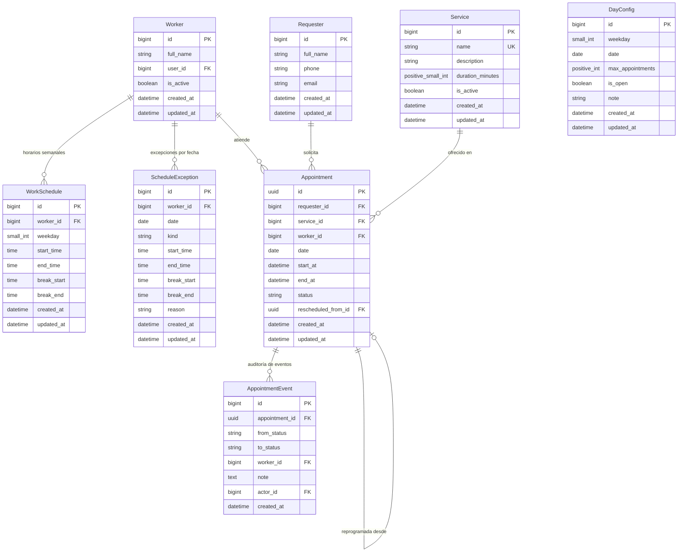

# Agenda de Citas (microapp Django)

Microapp para gestionar citas: apertura y cierre de agenda, cupos por día, asignación automática de personal, lista de espera, cancelación y reposición de fechas.

## Stack

- Python 3.12+, Django 5.x / 6.x, Django REST Framework
- Gestión de entorno y dependencias: [uv](https://docs.astral.sh/uv/) (`pyproject.toml` + `uv.lock`)
- PostgreSQL (SQLite para pruebas unitarias locales)
- Celery + Redis (opcional: reasignación de espera, recordatorios)
- pytest + pytest-django, ruff
- Zona horaria: `America/Mexico_City`

## Conceptos clave

| Concepto | Descripción |
|---|---|
| **Solicitante** | Persona que pide la cita (nombre, teléfono normalizado, correo). |
| **Servicio** | Tipo de cita con duración en minutos (**≤ 60**, configurable). |
| **Trabajador** | Personal que atiende. Tiene horario propio por día de la semana. |
| **Horario laboral** | Entrada, salida y descanso opcional por trabajador y día. |
| **Excepción de horario** | Ausencia, vacaciones o horario especial en una fecha concreta. |
| **Configuración de día** | Cupo máximo de citas y estado abierto/cerrado, por día de la semana (default) o por fecha (override). |
| **Cita** | Solicitante + servicio + fecha/hora + trabajador (nulo si está en espera). Identificador UUID v4. |
| **Evento de Cita** | Registro inmutable de auditoría para cada transición de estado de una cita. |
| **Lista de espera** | Citas sin trabajador disponible; se asignan por orden de llegada (FIFO). |

## Modelo de datos



### Reglas de validación e integridad en modelos

| Modelo | Regla / Constraint | Nivel | Descripción |
|---|---|---|---|
| **`Requester`** | `requester_phone_or_email_required` | `clean()` + `CheckConstraint` | Al menos uno de `phone` o `email` debe estar presente y no vacío. |
| **`Service`** | `service_duration_range` | `clean()` + `CheckConstraint` | `5 <= duration_minutes <= 60`. Nombre único en el catálogo. |
| **`Worker`** | `worker_profile` | `OneToOneField` | Un usuario Django puede vincularse a un solo trabajador. Borrado físico deshabilitado en Admin. |
| **`WorkSchedule`** | `unique_worker_weekday_schedule` | `UniqueConstraint` | Único por combinación `(worker, weekday)`. |
| **`WorkSchedule`** | `work_schedule_start_lt_end` | `clean()` + `CheckConstraint` | `start_time < end_time` (sin cruzar medianoche). |
| **`WorkSchedule`** | `work_schedule_break_all_or_nothing` | `clean()` + `CheckConstraint` | Descanso todo o nada (`break_start` y `break_end` ambos definidos o ambos nulos). |
| **`WorkSchedule`** | `work_schedule_break_within_shift` | `clean()` + `CheckConstraint` | `start_time <= break_start < break_end <= end_time`. |
| **`ScheduleException`** | `unique_worker_date_exception` | `UniqueConstraint` | Único por combinación `(worker, date)`. |
| **`ScheduleException`** | `schedule_exception_valid_structure` | `clean()` + `CheckConstraint` | `ABSENCE`: sin horas ni descansos. `SPECIAL_HOURS`: horas de turno obligatorias y descansos válidos. |
| **`DayConfig`** | `day_config_either_weekday_or_date` | `clean()` + `CheckConstraint` | Exactamente uno presente: `weekday` (default) o `date` (override). |
| **`DayConfig`** | `unique_day_config_weekday` / `date` | `UniqueConstraint` condicional | Un único default por `weekday` y un único override por `date`. |
| **`Appointment`** | `appointment_end_gt_start` | `clean()` + `CheckConstraint` | `end_at > start_at`. |
| **`Appointment`** | `appointment_confirmed_has_worker` | `clean()` + `CheckConstraint` | `CONFIRMED` requiere `worker` no nulo. |
| **`Appointment`** | `appointment_waitlisted_no_worker` | `clean()` + `CheckConstraint` | `WAITLISTED` requiere `worker` nulo. |
| **`Appointment`** | `appointment_exclude_overlapping_worker` | `PostgresExclusionConstraint` | PostgreSQL `ExclusionConstraint` con `BtreeGistExtension` impidiendo solape `(worker =, tstzrange(start_at, end_at) &&)` para estados en `OCCUPYING_STATUSES`. |
| **`AppointmentEvent`** | Inserción append-only | `admin` + `models` | Registro inmutable de cada cambio de estado. |

## Estados de la cita y consumo de recursos

```
SOLICITADA ──asignación──► CONFIRMADA ──► COMPLETADA
    │                          │
    │ (sin personal)           ├──► CANCELADA
    ▼                          ├──► NO_SHOW
  EN_ESPERA ──(se libera)──►   └──► REPROGRAMADA (enlaza a la nueva cita)
    │
    └──► CANCELADA / EXPIRADA
```

### Tabla de consumo de cupo y ocupación de personal

| Estado (`AppointmentStatus`) | Consume Cupo Diario (`QUOTA_STATUSES`) | Ocupa Tiempo de Personal (`OCCUPYING_STATUSES`) | Cita Activa de Solicitante (`ACTIVE_STATUSES`) |
|---|---|---|---|
| `REQUESTED` | No | No | No |
| `CONFIRMED` | **Sí** | **Sí** | **Sí** |
| `WAITLISTED` | **Sí** | No (sin trabajador) | **Sí** |
| `COMPLETED` | **Sí** | **Sí** | No |
| `NO_SHOW` | **Sí** | **Sí** | No |
| `CANCELLED` | No | No | No |
| `RESCHEDULED` | No | No | No |
| `EXPIRED` | No | No | No |

> **Nota:** Que `WAITLISTED` consuma cupo garantiza que cuando la cita sea asignada a un trabajador liberado, siempre tenga lugar garantizado en el cupo efectivo del día.

## Reglas de negocio

### 1. Apertura, ventana y solicitantes
- Cada día puede estar **abierto** o **cerrado** (`DayConfig.is_open`).
- Ventana de reserva: `BOOKING_MIN_ADVANCE_HOURS` (anticipación mínima) y `BOOKING_MAX_ADVANCE_DAYS` (máximo a futuro).
- **Identificación del solicitante:** Se identifica por teléfono normalizado (solo dígitos; remueve prefijo `52` si quedan 12 dígitos) o por correo electrónico en minúsculas. Si ya existe un registro con ese teléfono o correo, se reutiliza sin sobrescribir su nombre.
- Límite diario por solicitante: `MAX_ACTIVE_PER_REQUESTER_PER_DAY` citas activas (`CONFIRMED`, `WAITLISTED`) por fecha; no se permiten citas traslapadas para el mismo solicitante.

### 2. Duración y capacidad
- La duración la define el servicio (`duration_minutes`, 5–60 min).
- Una cita no puede cruzar el descanso. Capacidad por trabajador en un día:

```
capacidad_trabajador = Σ floor(minutos_del_tramo / duración)  (por cada tramo continuo de trabajo)
capacidad_personal   = Σ capacidad_trabajador                (solo trabajadores activos y sin excepción)
cupo_efectivo        = min(DayConfig.max_appointments, capacidad_personal)
```

- Si `max_appointments` es nulo, solo aplica la capacidad del personal.
- Una cita se acepta solo si `citas_que_consumen_cupo < cupo_efectivo`.

### 3. Asignación de personal y concurrencia
1. Se buscan trabajadores con turno que cubran `[inicio, fin)` sin cruzar descanso y sin cita que ocupe su tiempo en ese intervalo.
2. Se elige al trabajador de **menor carga del día** (citas en `OCCUPYING_STATUSES`); en caso de empate, el de menor `id`.
3. Si ningún trabajador está libre → la cita se crea como `WAITLISTED` sin trabajador asignado (salvo si se superó `WAITLIST_MAX_PER_DAY`, en cuyo caso lanza `WaitlistFull`).
4. **Concurrencia:** Todo el proceso de reserva corre dentro de `transaction.atomic()`. Para evitar carreras por el cupo o doble asignación incluso sin fila previa de `DayConfig`, se toma un lock consultivo a nivel de transacción en PostgreSQL `pg_advisory_xact_lock(42, date.toordinal())`. Adicionalmente, el `PostgresExclusionConstraint` actúa como red de seguridad en BD.

### 4. Lista de espera (FIFO) y Reasignación Automática
- **FIFO estricto sin bloqueo de cabecera:** Las citas en espera se evalúan por orden de llegada (`created_at, id`). Si la primera de la fila no puede asignarse (porque su horario particular sigue ocupado), **no frena** a las siguientes solicitudes con otros horarios libres.
- **Promover no cambia el cupo consumido:** Tanto `WAITLISTED` como `CONFIRMED` computan en `QUOTA_STATUSES`. Al asignarse personal a una cita en espera, no se recalcula `QuotaExceeded`. Por lo tanto, **subir el cupo no libera citas en espera**.
- **Único punto de entrada:** `process_waitlist(date)` en `agenda/services/waitlist.py` centraliza toda la lógica de asignación con lock consultivo por día (`day_advisory_lock`).

#### Disparadores de reasignación

| Evento disparador | Mecanismo | Efecto |
|---|---|---|
| **Cancelación de cita** | Fase 5 service | Libera intervalo del trabajador y ejecuta `process_waitlist(date)`. |
| **Reprogramación de cita** | Fase 5 service | Libera horario anterior y ejecuta `process_waitlist(date)`. |
| **Alta o activación de personal (`Worker`)** | Admin / Service | `schedule_waitlist_processing()` encola reasignación asíncrona. |
| **Cambio de horario (`WorkSchedule`)** | Admin / Service | Amplía tramos laborales y dispara `process_waitlist`. |
| **Eliminación de ausencia (`ScheduleException`)** | Admin / Service | Restablece disponibilidad del trabajador y reasigna citas. |
| **Reapertura de día (`DayConfig.is_open=True`)** | Admin / Service | Habilita el día y asigna citas pendientes en espera. |
| **Barrido periódico (Celery Beat)** | Celery Beat | Ejecuta `waitlist_maintenance_task` cada `WAITLIST_SWEEP_MINUTES`. |

> **Nota:** Subir el cupo (`DayConfig.max_appointments`) **no** dispara reasignación porque las citas en lista de espera ya consumieron cupo en su reserva original.

- **Expiración automática:** Si llega la fecha y hora de inicio (`start_at <= now`) de una cita `WAITLISTED` sin haberse asignado a un trabajador, el servicio `expire_waitlist()` la marca como `EXPIRED` con su respectivo `AppointmentEvent`. Las citas expiradas dejan de consumir cupo.

### 5. Auditoría
- Todo cambio de estado crea obligatoriamente un registro `AppointmentEvent` inmutable (`appointment`, `from_status`, `to_status`, `worker`, `note`, `actor`).
- Prohibido modificar `status` o `worker` fuera de las funciones en `agenda/services/`.

### 6. Cambios de horario del personal y revalidación
- **Punto de entrada único:** `revalidate_worker(worker_id)` en `agenda/services/schedules.py` centraliza la revalidación tras modificar horarios semanales, excepciones de fecha o el estado activo de un personal.
- **Revalidación exclusiva de citas futuras:** Solo se evalúan citas en estado `CONFIRMED` con `start_at > now`. Las citas pasadas o en curso no se modifican.
- **Prioridad de resolución de citas desplazadas:**
  1. **Reasignación a otro trabajador libre:** Mediante `reassign_worker()` se busca otro trabajador disponible con menor carga (manteniendo estado `CONFIRMED` y registrando evento `CONFIRMED -> CONFIRMED` con el nuevo trabajador).
  2. **Paso a lista de espera:** Si no hay trabajador libre, la cita transiciona a `WAITLISTED` (`worker=None`) mediante `transition(..., via_revalidation=True)` conservando su `created_at` original para mantener su prioridad FIFO y saltándose el tope `WAITLIST_MAX_PER_DAY`.
  3. **Citas inatendibles:** Citas en espera que ya no caben en ningún tramo de ningún trabajador son detectadas con `list_unserviceable_waitlist()` y filtrables en la API (`?unserviceable=true`) para resolución manual por staff.
- **Sobrecupo:** Si una reducción de horario reduce el cupo efectivo por debajo de las citas activas existentes, no se cancela ninguna cita. El día se marca como `over_quota` y se impiden nuevas reservas (`remaining_quota = 0`).
- **Confirmación obligatoria y Dry-Run:**
  - Cambios con impacto sin `confirm=true` → error `409 Conflict` (`SCHEDULE_CHANGE_REQUIRES_CONFIRMATION`) con el desglose de `impact` y reversión total.
  - Con `dry_run=true` → retorna `200 OK` con `{"applied": false, "impact": {...}}` sin modificar la base de datos.
  - Cambios sin citas afectadas se aplican de forma inmediata.
- **Barrido periódico y comando de gestión:** Celery Beat ejecuta periódicamente `waitlist_maintenance_task` en orden: `expire_waitlist` → `revalidate_all` → `process_waitlist_all`. También disponible mediante el comando `revalidate_assignments [--worker ID]`.

## Estructura del proyecto

```
agenda/
├── adapters/          # Adaptadores externos (AppointmentBusySlots que implementa BusySlotsPort)
├── api/               # Serializers, views delgadas, urls (sin lógica de negocio)
├── exceptions.py      # Excepciones de dominio tipadas con código y http_status
├── management/        # Comandos administrativos (seed_demo, process_waitlist, expire_waitlist, revalidate_assignments)
├── models/            # Requester, Service, Worker, WorkSchedule, ScheduleException,
│                      # DayConfig, Appointment, AppointmentEvent
├── ports.py           # Protocolo BusySlotsPort y NullBusySlots
├── selectors/         # Consultas de solo lectura (get_day_availability, get_appointment, list_waitlist, schedules)
├── services/          # Casos de uso (booking, waitlist, assignment, capacity, schedules, cancellation, locks)
├── tasks.py           # Tareas Celery (process_waitlist_task, waitlist_maintenance_task)
├── admin.py           # Admin de Django (Appointment sólo lectura, WaitlistTriggerMixin)
├── tests/             # Tests unitarios, de integración y de concurrencia
└── migrations/        # Migraciones versionadas (incluye BtreeGistExtension)
```

## API (v1)

| Método | Ruta | Permiso | Descripción |
|---|---|---|---|
| GET | `/api/v1/availability/?date=&service=` | Público | Horarios libres y cupo restante |
| POST | `/api/v1/appointments/` | Público | Solicitar cita (confirma o deja en espera) |
| GET | `/api/v1/appointments/{id}/` | Público | Detalle de cita por UUID (incluye `waitlist_position`) |
| GET | `/api/v1/appointments/?unserviceable=true` | Staff | Listado de citas en espera que no caben en ningún horario |
| GET | `/api/v1/waitlist/?date=YYYY-MM-DD` | Staff | Lista FIFO de citas en espera con posición |
| POST | `/api/v1/appointments/{id}/cancel/` | Público | Cancelar cita |
| POST | `/api/v1/appointments/{id}/reschedule/` | Público | Reprogramar cita |
| GET | `/api/v1/workers/{id}/schedule/` | Staff / Trabajador propio | Horario semanal y excepciones futuras |
| PUT | `/api/v1/workers/{id}/schedule/` | Staff / Trabajador propio | Reemplaza horario semanal (soporta `confirm`, `dry_run`) |
| POST | `/api/v1/workers/{id}/exceptions/` | Staff / Trabajador propio | Crea ausencia u horario especial (soporta `confirm`, `dry_run`) |
| DELETE | `/api/v1/workers/{id}/exceptions/{exc_id}/` | Staff / Trabajador propio | Elimina una excepción de horario |
| PATCH | `/api/v1/workers/{id}/` | Staff | Activa o desactiva trabajador (`is_active`, `confirm`, `dry_run`) |
| GET | `/api/v1/day-configs/{date}/` | Staff | Configuración del día y resumen de cupos/ocupación |
| PUT | `/api/v1/day-configs/{date}/` | Staff | Actualiza cupo y apertura (`is_open`, `max_appointments`, `note`) |
| GET/PUT | `/api/v1/day-configs/weekday/{0-6}/` | Staff | Configuración por defecto por día de la semana |

---

### Solicitar Cita (`POST /api/v1/appointments/`)

**Payload de solicitud:**

```json
{
  "requester": {
    "full_name": "Ana Pérez",
    "phone": "+52 993 123 4567",
    "email": "ana.perez@example.com"
  },
  "service": 1,
  "start_at": "2026-10-12T09:00:00-06:00"
}
```

**Respuesta confirmada (`201 Created`):**

```json
{
  "id": "7fa82645-17a4-44cf-a6e5-4f402f04df97",
  "status": "CONFIRMED",
  "service": {
    "id": 1,
    "name": "Consulta General",
    "duration_minutes": 30
  },
  "date": "2026-10-12",
  "start_at": "2026-10-12T09:00:00-06:00",
  "end_at": "2026-10-12T09:30:00-06:00",
  "requester": {
    "id": 1,
    "full_name": "Ana Pérez",
    "phone": "9931234567",
    "email": "ana.perez@example.com"
  },
  "worker_name": "Dra. Ana López"
}
```

**Respuesta en lista de espera (`201 Created`):**

```json
{
  "id": "9938b812-70b9-4a46-88fe-7096fb0081d4",
  "status": "WAITLISTED",
  "service": {
    "id": 1,
    "name": "Consulta General",
    "duration_minutes": 30
  },
  "date": "2026-10-12",
  "start_at": "2026-10-12T09:00:00-06:00",
  "end_at": "2026-10-12T09:30:00-06:00",
  "requester": {
    "id": 2,
    "full_name": "Carlos Ruiz",
    "phone": "5551234567",
    "email": "carlos@example.com"
  },
  "worker_name": null
}
```

---

### Detalle de Cita (`GET /api/v1/appointments/{id}/`)

Retorna `200 OK` con la información completa de la cita. Si la cita está en estado `WAITLISTED`, incluye el campo `waitlist_position` con la posición entera (`1`, `2`, …) dentro de la lista de espera para ese día. Si la cita ya está `CONFIRMED` o en otro estado, `waitlist_position` es `null`.

```json
{
  "id": "9938b812-70b9-4a46-88fe-7096fb0081d4",
  "status": "WAITLISTED",
  "service": {
    "id": 1,
    "name": "Consulta General",
    "duration_minutes": 30
  },
  "date": "2026-10-12",
  "start_at": "2026-10-12T09:00:00-06:00",
  "end_at": "2026-10-12T09:30:00-06:00",
  "requester": {
    "id": 2,
    "full_name": "Carlos Ruiz",
    "phone": "5551234567",
    "email": "carlos@example.com"
  },
  "worker_name": null,
  "waitlist_position": 1
}
```

---

### Listado de Lista de Espera (`GET /api/v1/waitlist/?date=YYYY-MM-DD`)

Exclusivo para usuarios Staff (`IsAdminUser`). Parámetro `date` obligatorio.

Retorna la lista ordenada FIFO (`created_at, id`) de las citas en espera para esa fecha con su posición actual:

```json
[
  {
    "id": "9938b812-70b9-4a46-88fe-7096fb0081d4",
    "position": 1,
    "requester_name": "Carlos Ruiz",
    "service": {
      "id": 1,
      "name": "Consulta General",
      "duration_minutes": 30
    },
    "start_at": "2026-10-12T09:00:00-06:00",
    "created_at": "2026-10-07T12:00:00-06:00"
  }
]
```

---

### Detalle de Disponibilidad (`GET /api/v1/availability/`)

Parámetros requeridos: `date` (`YYYY-MM-DD`) y `service` (`id` entero).

Utiliza `AppointmentBusySlots` para descontar citas en `OCCUPYING_STATUSES` de los trabajadores libres por horario y citas en `QUOTA_STATUSES` del cupo restante diario.

```json
{
  "date": "2026-10-12",
  "service": {
    "id": 1,
    "name": "Consulta General",
    "duration_minutes": 30
  },
  "is_open": true,
  "reason": null,
  "effective_quota": 20,
  "remaining_quota": 19,
  "slots": [
    {
      "start": "2026-10-12T09:00:00-06:00",
      "end": "2026-10-12T09:30:00-06:00",
      "free_workers": 1
    }
  ]
}
```

---

### Cambios de Horario y Esquema de Impacto (`PUT /api/v1/workers/{id}/schedule/`)

Permite previsualizar (`dry_run=true`) o aplicar (`confirm=true`) cambios de horario:

**Payload:**

```json
{
  "entries": [
    {
      "weekday": 0,
      "start_time": "09:00",
      "end_time": "14:00",
      "break_start": null,
      "break_end": null
    }
  ],
  "confirm": false,
  "dry_run": false
}
```

**Respuesta cuando afecta citas sin confirmación (`409 Conflict`):**

```json
{
  "code": "SCHEDULE_CHANGE_REQUIRES_CONFIRMATION",
  "detail": "El cambio de horario afecta citas existentes y requiere confirmación.",
  "impact": {
    "displaced": [
      {
        "appointment_id": "7fa82645-17a4-44cf-a6e5-4f402f04df97",
        "date": "2026-10-12",
        "start_at": "2026-10-12T15:00:00-06:00",
        "requester_name": "Ana Pérez",
        "outcome": "WAITLISTED",
        "new_worker_name": null,
        "unserviceable": true
      }
    ],
    "reassigned": 0,
    "waitlisted": 1,
    "unserviceable": 1,
    "promoted_from_waitlist": 0,
    "over_quota": []
  }
}
```

---

## Configuración (`settings` / variables de entorno)

| Variable | Default | Descripción |
|---|---|---|
| `BOOKING_MIN_ADVANCE_HOURS` | 2 | Anticipación mínima para agendar (horas) |
| `BOOKING_MAX_ADVANCE_DAYS` | 60 | Máximo de días a futuro para agendar |
| `CANCEL_MIN_HOURS` | 4 | Anticipación mínima para cancelar/reprogramar |
| `MAX_RESCHEDULES_PER_APPOINTMENT` | 2 | Reprogramaciones permitidas por cita |
| `MAX_ACTIVE_PER_REQUESTER_PER_DAY` | 1 | Citas activas por solicitante/día |
| `WAITLIST_MAX_PER_DAY` | 20 | Tope de citas en espera por día |
| `DEFAULT_SLOT_STEP_MINUTES` | 15 | Granularidad de horarios ofrecidos (minutos) |
| `WAITLIST_SWEEP_MINUTES` | 5 | Intervalo del barrido periódico de mantenimiento (minutos) |
| `CELERY_BROKER_URL` | `redis://localhost:6379/0` | URL del broker Redis para tareas Celery |
| `CELERY_RESULT_BACKEND` | `redis://localhost:6379/0` | Backend de resultados para Celery |

## Puesta en marcha

```bash
uv sync                              # crea .venv e instala dependencias
cp .env.example .env
docker compose up -d db redis        # levanta PostgreSQL y Redis
uv run python manage.py migrate
uv run python manage.py seed_demo
uv run python manage.py runserver    # API en desarrollo
```

### Ejecutar Celery Worker y Beat

```bash
uv run celery -A config worker -l info   # procesador de tareas asíncronas
uv run celery -A config beat -l info     # programador de tareas periódicas
```

### Comandos de gestión de lista de espera y revalidación

```bash
uv run python manage.py process_waitlist                 # procesa todas las fechas activas
uv run python manage.py process_waitlist --date 2026-10-12 # procesa una fecha específica
uv run python manage.py expire_waitlist                  # expira citas en espera vencidas
uv run python manage.py revalidate_assignments           # revalida citas de todos los trabajadores
uv run python manage.py revalidate_assignments --worker 1# revalida citas de un trabajador específico
```

### Tests y calidad

```bash
uv run pytest
uv run ruff check . && uv run ruff format --check .
```